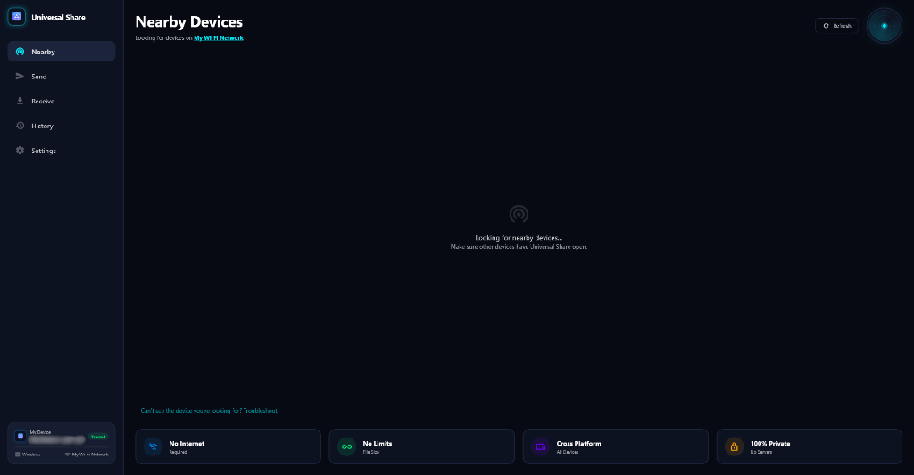

<p align="center">
  
</p>

<h1 align="center">🌐 Universal Share</h1>

<p align="center">
  <b>A Secure, High-Performance, Cross-Platform Local Peer-to-Peer File Sharing Suite</b>
</p>

<p align="center">
  
  
  
  
  
</p>

<p align="center">
  <a href="https://github.com/PRIYANSHVERMA-droid/Universal-share/releases">
    
  </a>
</p>

---

## 🚀 Overview

**Universal Share** is a state-of-the-art, fully local peer-to-peer file transfer workstation built with Flutter. It enables high-speed, secure, and zero-configuration file sharing within local area networks (LAN) without relying on internet access, external servers, or cloud storage. 

By utilizing dynamic, self-signed TLS certificates for end-to-end encryption and a dual-mode peer discovery mechanism (mDNS Zeroconf and UDP broadcast), Universal Share delivers top-tier performance while keeping your files entirely confidential. **Your data never leaves your local network.**

### 💎 Key Highlights
- **100% Private & Local:** Dynamic local TLS socket handshakes ensure absolute confidentiality.
- **Zero Configuration:** Scan, connect, and transfer instantly without manually typing IP addresses.
- **Dual-Mode Discovery:** mDNS client/server with automated UDP broadcast fallback to support restricted routers and cross-device connections.
- **Interactive Radar UI:** A modern, custom-rendered canvas radar scanner mapping local peers in real time.

---

## 🖥️ User Interface Preview

### 📡 Radar Scan Dashboard
A sleek, responsive system landing dashboard featuring real-time peer discovery and visual concentric radar feedback.

<p align="center">
  
</p>

---

## 🔥 Features & Capabilities

### 📡 Zero-Configuration Discovery
- **mDNS Engine:** Registers and resolves local devices automatically using the `_universalshare._tcp` service type identifier.
- **UDP Broadcast Fallback:** Periodically broadcasts presence packets (every 3 seconds) over port `53318` to discover Windows and Android devices where mDNS might be restricted by router firewalls.
- **Active Peer Tracking:** Automatically evicts peers that haven't responded within `10 seconds` to maintain a live, up-to-date scanning dashboard.

### 🛡️ Secure Pairing & Trust
- **Dynamic TLS Generation:** Creates RSA 2048-bit keys and X.509 self-signed certificates locally at boot using PointyCastle.
- **PIN-Based Handshake:** Generates a one-time 4-digit PIN for first-time connections to prevent unwanted files from being pushed to your device.
- **Certificate Fingerprinting:** Verifies and stores trusted peers' certificate SHA-256 hashes to bypass PIN verification in future transfer sessions.
- **Safe Directory Sanitization:** Sanitizes relative paths for received assets to prevent Directory Traversal attacks.

### ⚡ Streamed Transfers
- **Shelf Web Engine:** Hosts a local HTTPS server dynamically binding from ports `53317` to `53327`.
- **Buffered Chunking:** Streams file contents directly to disk, avoiding high RAM footprints for massive gigabyte transfers.
- **SHA-256 Integrity Check:** Transmits checksum headers with every file and re-verifies them at destination before confirming success.

---

## ⚙️ Transfer Protocol Specs

| Step | Protocol | Port | Mechanism |
| :--- | :--- | :--- | :--- |
| **Discovery** | mDNS / UDP Broadcast | `53318` | Zeroconf announcements and fallback UDP presence broadcasts |
| **Handshake** | HTTPS (TLS v1.3) | `53317 - 53327` | POST `/transfer-request` with fingerprint and file list metadata |
| **Pairing** | Security Check | `53317 - 53327` | PIN validation on incoming requests for untrusted peers |
| **Streaming** | HTTPS Stream | `53317 - 53327` | PUT `/transfer/<sessionId>/file/<index>` with SHA-256 integrity headers |

---

## 🛠️ Tech Stack

Universal Share combines modern Flutter modules for reliable local cross-platform utility:

- **Flutter & Material Design 3** – Cross-platform desktop and mobile rendering engine with dynamic theme-switching.
- **Riverpod 2** – Compile-safe state container and dependency injection framework.
- **Shelf & Shelf Router** – A lightweight, pluggable web server pipeline for handling incoming connection endpoints.
- **PointyCastle & Basic Utils** – Cryptographic libraries for generating TLS keys and self-signed certificates on the fly.
- **nsd (Network Service Discovery)** – Native mDNS/DNS-SD implementation for device discovery.
- **Shared Preferences** – Secure local repository for trusted device fingerprints and system preferences.

---

## 📥 Installation & Setup

Getting started with Universal Share requires only the standard Flutter environment setup:

1. **Clone the repository**:
   ```bash
   git clone https://github.com/yourusername/universal_share.git
   cd universal_share
   ```

2. **Retrieve dependencies**:
   ```bash
   flutter pub get
   ```

3. **Compile Code Generation Bindings**:
   ```bash
   dart run build_runner build --delete-conflicting-outputs
   ```

4. **Launch the application**:
   - For Windows Desktop:
     ```bash
     flutter run -d windows
     ```
   - For Mobile Platforms:
     ```bash
     flutter run
     ```

👉 [Download the Latest Release](https://github.com/PRIYANSHVERMA-droid/Universal-share/releases)

---

## 📁 Project Directory Structure

```
Universal Share
├── assets/
│   ├── fonts/
│   ├── icons/
│   │   └── logo.png
│   ├── lottie/
│   └── screenshots/
│       └── nearby_devices.png
│
├── lib/
│   ├── app.dart                        # Core MaterialApp configuration and theme selection
│   ├── main.dart                       # App entry point (initializes DB, certs, preferences)
│   ├── core/                           # Shared modules, engines, and utilities
│   │   ├── constants/                  # AppConstants (ports, timeouts, keys)
│   │   ├── models/                     # Shared models (DeviceModel, TransferFileModel, etc.)
│   │   ├── network/                    # Core communication classes (discovery, server, client, TLS)
│   │   ├── providers/                  # Shared Riverpod providers (storage, network configs)
│   │   ├── storage/                    # Storage and Database repository implementations
│   │   └── theme/                      # Sleek dark and light Material Design 3 themes
│   └── features/                       # Self-contained modules/features
│       ├── discovery/                  # Radar dashboard screen and active scan controls
│       │   ├── application/
│       │   └── presentation/
│       │       ├── discovery_screen.dart
│       │       └── widgets/
│       │           ├── concentric_radar_view.dart
│       │           ├── device_card.dart
│       │           ├── mini_radar_scanner.dart
│       │           └── radar_animation.dart
│       ├── history/                    # List and clear operations for transfer logs
│       │   ├── application/
│       │   └── presentation/
│       │       └── history_screen.dart
│       ├── pairing/                    # First-time security authorization flow
│       ├── receive/                    # Incoming file alert, PIN validation dialogs
│       │   ├── application/
│       │   └── presentation/
│       │       └── incoming_request_dialog.dart
│       ├── send/                       # File selection, peer confirmations, transfer progress
│       │   ├── application/
│       │   └── presentation/
│       │       ├── send_confirmation_sheet.dart
│       │       ├── send_files_dialog.dart
│       │       └── transfer_progress_screen.dart
│       └── settings/                   # Custom settings panel UI and state manager
│           ├── application/
│           └── presentation/
│               └── settings_screen.dart
│
├── pubspec.yaml
├── analysis_options.yaml
└── README.md
```

---

## 💡 Important Notes

- **Network Configuration:** Both devices must be connected to the same local area network (LAN). Guest networks or enterprise routers with AP isolation enabled may block peer-to-peer discovery and socket connections.
- **Windows Firewall:** Ensure that Windows Defender Firewall allows incoming/outgoing traffic for the app executable on private networks.
- **Battery Optimization:** On Android devices, disable battery optimizations for Universal Share to prevent background servers from shutting down during large file streams.

---

## 🔮 Future Roadmap

- 📱 **QR Code Sharing:** Generate and scan dynamic QR codes containing pairing details and host IP for instant, pin-less pairing.
- 📦 **Multi-Peer Send:** Stream the same set of files concurrently to multiple selected recipients on the radar dashboard.
- 📂 **Web Share Interface:** Spin up a temporary local HTTP portal allowing non-app clients to download files via web browser.
- ⚙️ **Custom Bandwidth Throttling:** Add settings to cap transfer rates to preserve host system resource availability.

---

## 🤝 Contributing

Contributions make the open-source community an amazing place to learn, inspire, and create.
1. Fork the Project.
2. Create your Feature Branch (`git checkout -b feature/AmazingFeature`).
3. Commit your Changes (`git commit -m 'Add some AmazingFeature'`).
4. Push to the Branch (`git push origin feature/AmazingFeature`).
5. Open a Pull Request.

---

## 📜 License

Distributed under the MIT License. See `LICENSE` for more information.


