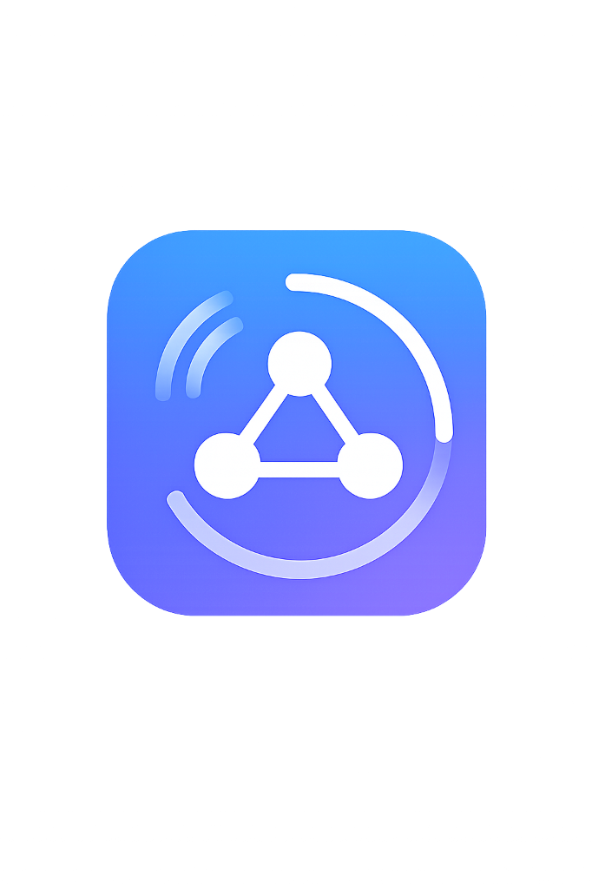
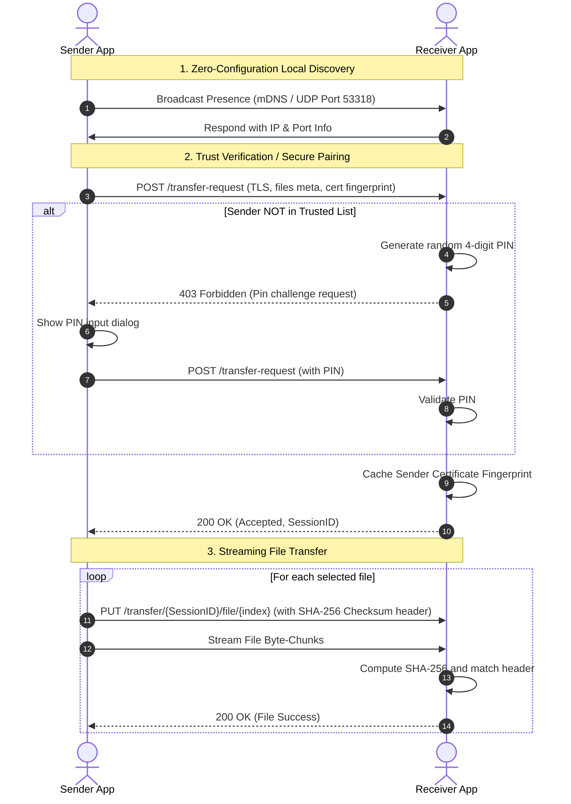

<p align="center">
  
</p>

<h1 align="center">Universal Share</h1>

<p align="center">
  A secure, cross-platform local file transfer application built with Flutter.
</p>

<p align="center">
  Universal Share allows seamless, encrypted peer-to-peer file sharing within local area networks (LAN) without requiring an internet connection, third-party servers, or cloud storage.
</p>

Designed with a focus on privacy, speed, and sleek aesthetics, Universal Share implements end-to-end TLS encryption, automatic zero-configuration peer discovery, and an interactive radar UI.


---

## 🚀 Key Features

- **Zero-Configuration Peer Discovery**: Leverages Multicast DNS (mDNS) Zeroconf and fallback UDP Broadcast packets to automatically discover nearby active devices on the same local network.
- **Secure End-to-End Encryption**: Every transfer is encrypted using dynamically generated self-signed TLS certificates.
- **Pin-Based Secure Pairing**: Untrusted devices must match a 4-digit PIN upon the first transfer request. The receiver verifies and white-lists the sender's certificate fingerprint for future seamless sharing.
- **High-Speed Transfers**: Stream-based file sending built on top of Dart's `HttpServer` and `shelf_router`, complete with chunk-by-chunk transmission.
- **Data Integrity Verification**: Validates file integrity via SHA-256 checksum headers before finalizing transfers.
- **Interactive Radar UI**: Features a beautiful, modern Concentric Radar animation mapping nearby active devices visually in real time.
- **Detailed History Logs**: Tracks all incoming and outgoing transfer sessions, with status details (pending, transferring, completed, failed, or cancelled).
- **Configurable Settings**: Custom device naming, user-selected downloads folder, auto-acceptance mode for trusted devices, and dark/light theme options.

---

## 🛠️ Technology Stack

Universal Share is engineered using modern Flutter architecture guidelines and robust networking packages:

| Category | Technology / Library | Purpose |
| --- | --- | --- |
| **Framework** | [Flutter SDK](https://flutter.dev) | Cross-platform frontend & desktop compilation |
| **State Management** | [Riverpod 2](https://riverpod.dev) | Predictable, compile-safe state container & dependency injection |
| **Networking** | [nsd](https://pub.dev/packages/nsd) & [shelf](https://pub.dev/packages/shelf) | Multicast DNS (mDNS) client/server & local shelf web server |
| **Security & Cryptography**| [pointycastle](https://pub.dev/packages/pointycastle) & [basic_utils](https://pub.dev/packages/basic_utils) | Self-signed certificate generation & TLS handshake utilities |
| **Database & Cache** | [shared_preferences](https://pub.dev/packages/shared_preferences) | Device preferences, download paths, and trusted fingerprints storage |
| **Utility** | [path_provider](https://pub.dev/packages/path_provider) & [file_picker](https://pub.dev/packages/file_picker) | File system navigation & cross-platform system file selection |

---

## 🏗️ Directory Structure

The project implements a **Clean, Feature-First Architecture** to isolate business logic from presentation:

```
lib/
├── app.dart                        # Core MaterialApp configuration and theme selection
├── main.dart                       # App entry point (initializes DB, certs, preferences)
├── core/                           # Shared modules, engines, and utilities
│   ├── constants/                  # AppConstants (ports, timeouts, keys)
│   ├── models/                     # Shared models (DeviceModel, TransferFileModel, etc.)
│   ├── network/                    # Core communication classes (discovery, server, client, TLS)
│   ├── providers/                  # Shared Riverpod providers (storage, network configs)
│   ├── storage/                    # Storage and Database repository implementations
│   └── theme/                      # Sleek dark and light Material Design 3 themes
└── features/                       # Self-contained modules/features
    ├── discovery/                  # Radar dashboard screen and active scan controls
    ├── history/                    # List and clear operations for transfer logs
    ├── pairing/                    # First-time security authorization flow
    ├── receive/                    # Incoming file alert, PIN validation dialogs
    ├── send/                       # File selection, peer confirmations, transfer progress
    └── settings/                   # Custom settings panel UI and state manager
```

---

## 🔄 File Transfer Protocol Workflow

Universal Share uses a secure local HTTP server running over HTTPS. Here is a high-level representation of how a transfer works:



---

## ⚙️ Installation & Setup

### Prerequisites
- [Flutter SDK](https://docs.flutter.dev/get-started/install) (Stable channel recommended)
- Dart SDK `>=3.3.0 <4.0.0`
- Android SDK, iOS Xcode, or Windows C++ build tools (depending on target platform)

### Getting Started

1. **Clone the repository**:
   ```bash
   git clone https://github.com/yourusername/universal_share.git
   cd universal_share
   ```

2. **Retrieve dependencies**:
   ```bash
   flutter pub get
   ```

3. **Generate code bindings** (for Riverpod, Freezed, or DB code generation if used):
   ```bash
   dart run build_runner build --delete-conflicting-outputs
   ```

4. **Launch the application**:
   - For Windows Desktop:
     ```bash
     flutter run -d windows
     ```
   - For Android:
     ```bash
     flutter run -d <android-device-id>
     ```
   - For iOS:
     ```bash
     flutter run -d <ios-device-id>
     ```

---

## 🛡️ Security Considerations

- **Self-Signed Certificates**: Since DNS/hostnames are dynamic on local LANs, the app generates custom self-signed TLS certificates on launch.
- **First-Time Pin Verification**: Prevents malicious hosts on the same network from initiating silent file-injections.
- **Path Sanitization**: Relative paths inside received folders are strictly checked and sanitized to prevent Directory Traversal attacks (e.g., trying to write files to `../../etc`).

